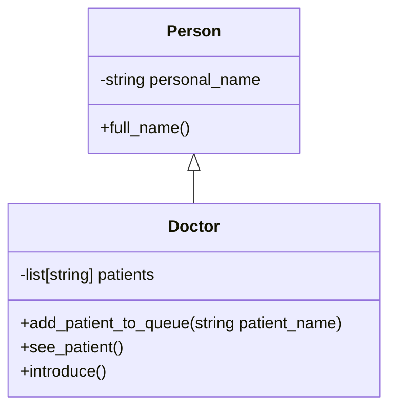

# Exercises

These are extra exercises, separate from those in lesson.md

## Seed code
Here is your seed code:
```python
class Person():
    def __init__(self, personal_name="", title=""):
        self.personal_name = personal_name
        self.title = title

    def full_name(self):
        if self.title:
            return f"{self.title} {self.personal_name}"
        return self.personal_name
```

###  Doctor
Make a class `Doctor`. It should inherit from `Person`

Here's the constructor to start you off:
```python
    def __init__(self, personal_name):
        super().__init__(personal_name, title="Dr")
```

Doctors should have personal names, and a list of strings referring to patients.


- `introduce`
- `add_patient_to_queue` should `append` a name to self.patients
- `see_patient` should remove the patient at the front of the queue (`pop(0)`)
- a person using this class should not be able to look at or modify the list of patients, that's confidential!

> When I say that the patients are confidential, I do not mean that you should try and figure out some kind of authentication: I mean that they are private to the doctor class 😅

#### 1.1 Reflect:
- What does the `Doctor` get from `Person`?
- Can you change a doctor's name? (should you?)

## Patient

1. What information would you need for a patient? What does the doctor need to know? (Consider; health conditions).
2. What should a patient be able to do? (Speak to their doctor?)
3. Which attributes should be private, which should be public?
4. Make your `Patient` class in a patient.py file.

## Advanced 
We'll cover this next week, but what if you wanted to make your Doctor's list of patients into a list of `Patient`?

